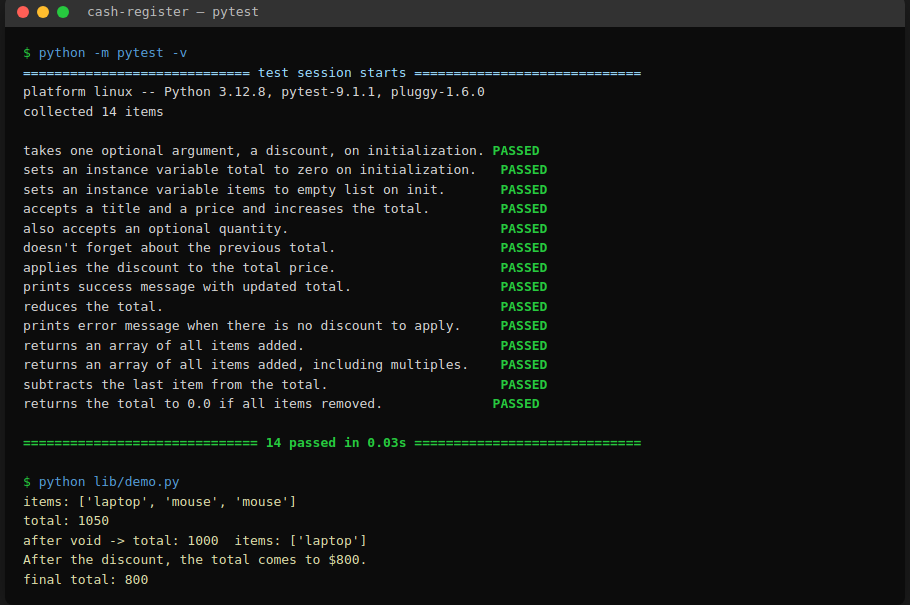

# Cash Register

A small object-oriented Python model of a cash register for an e-commerce
checkout. It tracks a running total, the items rung up, and a history of
transactions so purchases can be discounted or voided.



## Features

- **Add items** to the register with a price and an optional quantity.
- **Track a running total** plus a flat list of every item purchased.
- **Apply a percentage discount** to the current total.
- **Void the last transaction**, restoring the total and item list.

## Installation

Requires Python 3.8+ and `pytest`.

```bash
# Using the provided Pipfile
pipenv install
pipenv shell

# ...or with plain pip
pip install pytest
```

## Usage

```python
from cash_register import CashRegister

# Optionally open the register with a discount percentage (0 by default).
register = CashRegister(20)        # 20% off the total

register.add_item("laptop", 1000)  # add_item(item, price, quantity=1)
register.add_item("mouse", 25, 2)

register.items                     # ['laptop', 'mouse', 'mouse']
register.total                     # 1050

register.void_last_transaction()   # removes the 2 mice
register.total                     # 1000

register.apply_discount()          # -> "After the discount, the total comes to $800."
register.total                     # 800
```

A runnable version of the example above lives in `lib/demo.py`:

```bash
python lib/demo.py
```

## API

### `CashRegister(discount=0)`

| Attribute | Description |
| --- | --- |
| `discount` | Percentage off the total. Must be an integer from 0–100 (inclusive); otherwise `"Not valid discount"` is printed and the value is rejected. |
| `total` | Running total of all items. Starts at `0`. |
| `items` | List of item names, one entry per unit purchased. Starts empty. |
| `previous_transactions` | List of `{"item", "price", "quantity"}` records. Starts empty. |

| Method | Description |
| --- | --- |
| `add_item(item, price, quantity=1)` | Adds `price * quantity` to the total, appends the item to `items` once per unit, and records the purchase in `previous_transactions`. |
| `apply_discount()` | Reduces `total` by the discount percentage and prints the new total. Prints `"There is no discount to apply."` when the discount is 0. |
| `void_last_transaction()` | Removes the most recent purchase, restoring `total` and `items`. Prints `"There is no transaction to void."` when there is nothing to void. |

## Running the tests

```bash
pytest
```

All 14 tests in `lib/testing/cash_register_test.py` should pass.

## Project structure

```
lib/
  cash_register.py        # CashRegister class
  demo.py                 # runnable usage example
  testing/
    cash_register_test.py # pytest suite
assets/
  cash_register_demo.png  # screenshot of passing tests + demo
```
